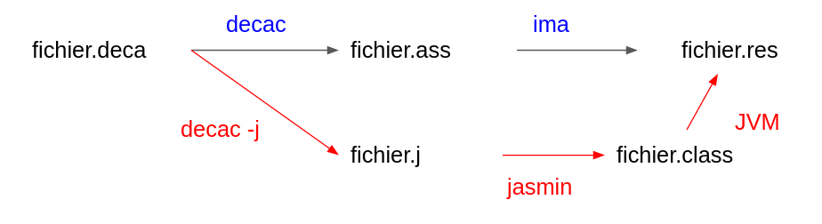

## Le bytecode Java, qu'est-ce que c'est?

Le bytecode java, c'est une série d'instruction binaire exécutable par une
machine virtuelle java (JVM). C'est les fichiers .class que l'on retrouve 
lorsque l'on compile du code java. Générer du bytecode depuis un autre language
(deca dans notre cas), permet d'exécuter notre code par une machine
virtuelle java. En général, cela est très utile si dans un même projet,
l'on souhaite faire de l'échange d'information entre plusieurs languages.
Savoir générer du bytecode permet donc d'améliorer la portabilité d'une 
application car n'importe quelle JVM sur n'importe quel système 
d'exploitation, que ce soit sur Windows, Linux ou Mac, pourra exécuter le 
programme deca écrit en entrée.

## Comment générer du bytecode Java ?

Pour générer du bytecode Java, il faut passer par un assembleur de bytecode.
Nous avons choisi pour cela Jasmin qui est le plus ancien et celui de référence.
Il est aussi suffisament documenté et optimisé pour que son utilisation soit 
simple et reste cohérente avec le projet quant à sa dimension environnementale.
Jasmin prend en entré un fichier .j en pseudo-assembleur. Ensuite, il suffit 
de générer un .class grace à une commande jasmin. Ce .class pourra être
exécuté par une JVM. 

## Intégration à notre logiciel

Le but ici est d'implémenter une option du compilateur qui pourra alors
générer le .class pour certaines fonctionnalités de notre compilateur. Ainsi, 
il faudra pour cela recréer une étape C bis qui traduira non pas en language
assembleur .ass mais en un fichier .j qui sera exécutable par jasmin
qui créera un .class. Ce .class pourra alors être exécutable par une JVM.

## Procédé de notre implémentation

Le but sera de pouvoir implémenter au fur et à mesure les différents types
d'instruction, en commençant par les affichages, puis des simples calculs et
enfin la génération de classe etc...

## Pourquoi cette solution ?

C'est la solution la plus pratique est la plus performante que nous avons trouvé. 
En effet, elle permet de réutiliser toute une partie de la génération du code
assembleur de déca qui est très intéressante, et l'outil clé en main jasmin
est reconnu dans la communauté de développeur comme étant le principal assembleur
de bytecode java. Utiliser cette solution permet de compacter le code et de 
gagner en rapidité d'exécution. 
