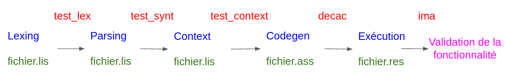

## Gestion des risques

### Méthodes de vérification manuel du code

Chaque partie de code, une fois développée, est soumis à une relcture par les pairs afin d'identifier des erreures évidentes de syntax
ou une mauvaise formatation du code. Tout code est donc relu afin de pouvoir mieux identifier la direction prise et les choix des différents développeurs. Une fois les code relu, il est mis en phase de tests.

### Méthodes de validation des tests

Plusieurs moyens sont mis en oeuvres afin de ne pas introduire de bugs massifs dans notre code. La première étant de prendre et de développer une fonctionnalité puis une autre, puis de la valider. Par exemple, si nous devons développer les opérations arithmétiques,
chaque étape du développement sera testé, tout d'abord par un test de lexing, puis par un test de parsing, puis par un test de context et 
enfin un test de compilation. Ainsi, si le test de la partie correspondantes est bon, la fonctionnalité est passez à la partie suivante,
sinon, un retour sur le bug est créé et une correction est proposée puis retesté. Le Schéma ci-dessous explique plus en détail la méthode de validation du travail:

### Couverture des tests

Pour savoir si notre code est bien testé sous toutes ses coutures, en plus d'une large gamme de tests, nous utilisons l'outil de couverture de tests Jacoco qui nous premet d'identifié les parties du code source qui n'ont pas été controlé. Ainsi, si l'on remarque que pour une programme, la couverture de tests est mauvaise, on en déduit qu'il faut créer des nouveaux tests afin de tester cette partie.

## Gestions des rendus

Avant chaque rendu, il sera important de tester et de relire la branche principal du git. C'est pour cela que nous travaillons de manière
quotidienne sur une branche git develop, sur laquel nous effectuons nos tests, nos relectures, nos tentatives de résolutions. Il n'est
push sur la branche master de notre git, celle qui fera fois de rendu, que les fonctionnalités qui ont passés toutes les étapes de
validation précedemment décrite. Ainsi, même si le jour du rendu une fonctionnalité n'est pas totalement terminé, elle ne sera pas rendu
pour éviter que les potentiels bugs qu'elle induirait détruise toute la structure du compilateur qui lui fonctionne déjà. Cela est fait
pour limiter au maximum les bugs majeurs qui seraient totalement contreproductif et nuirait au bon fonctionnement de notre compilateur.